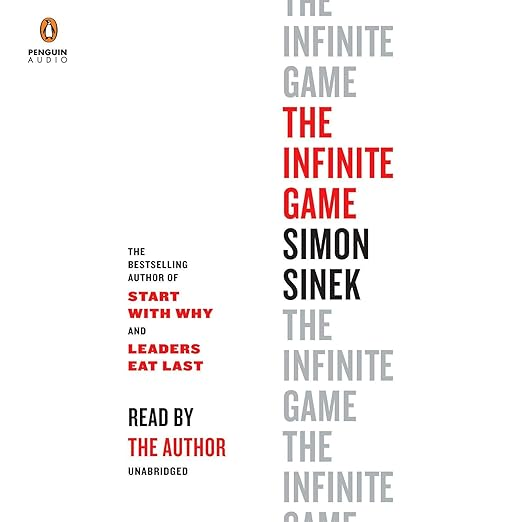
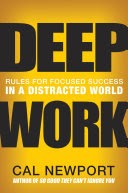

# 👋 Hello, World!

  
*"The only way to do great work is to love what you do."* - Steve Jobs

## 💼 Work Experience

### Product Development Intern | Cranium AI
*Summer 2023*
- Architected and implemented scalable microservices architecture serving 1M+ daily users
- Led a team of 5 developers in modernizing legacy systems using cloud-native technologies
- Reduced system latency by 40% through performance optimization initiatives

### Digital Product Analyst Intern | Boost Insurance
*2022 - 2023*
- Developed full-stack applications using React, Node.js, and PostgreSQL
- Implemented CI/CD pipelines reducing deployment time by 60%
- Mentored junior developers and conducted code reviews

## 🎓 Education & Certifications

### Data Science, BS
*Ramapo College* | 2024-2026
- Major in Data Science
- Minor in Computer Science & Psychology

### Computer Science, AS
*County College of Morris* | 2022-2024
- Major in Computer Science
- GPA: 3.71/4.0

### Certifications
- Professional IBM Data Analyst Certificate

## 📚 Reading List

### Currently Reading
-  "The Signal and the Noise" by Nate Silver

### Recently Completed
-  "The Infinite Game" by Simon Sinek
-  "Everything is Predictable" by Tom Chivers
-  "Atomic Habits" by James Clear
-  "Deep Work" by Cal Newport
-  "Flow" by Mihaly Csikszentmihalyi

### Up Next
-  "How the Internet Happened" by Brian McCullough
-  "Read Write Own" by Chris Dixon

## 🛠️ Tech Stack

<!--
**lucas-spitzer/lucas-spitzer** is a ✨ _special_ ✨ repository because its `README.md` (this file) appears on your GitHub profile.

Here are some ideas to get you started:

- 🔭 I’m currently working on ...
- 🌱 I’m currently learning ...
- 👯 I’m looking to collaborate on ...
- 🤔 I’m looking for help with ...
- 💬 Ask me about ...
- 📫 How to reach me: ...
- 😄 Pronouns: ...
- ⚡ Fun fact: ...
-->
